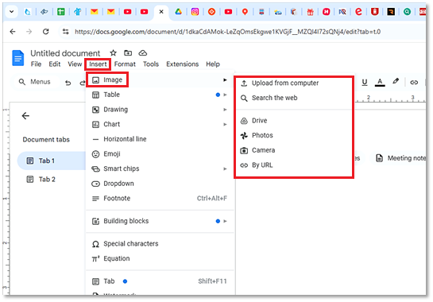
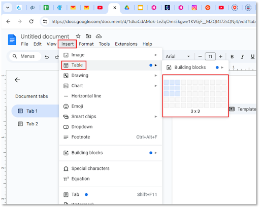
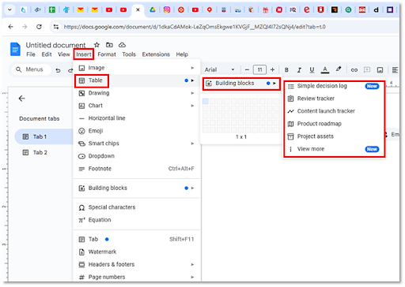
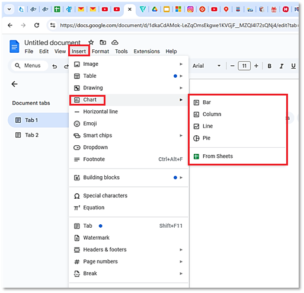

# **Add images, tables, diagrams**           

Use different kinds of images, tables, and charts to make your document more vivid and communicate your information more effectively to a reader.

## **Add image**

To add an image:  

1. Open a document in Google Docs.  
2. Go to the menu bar.  
3. Click **Insert** > :material-image-outline: **Image**.  
4. Choose the image source from the dropdown list.  
5. Find the image and click **Open** or **Insert**.  
    

|           **Image source**             |      **Explanations**                       |
| ---------------------------------------|---------------------------------------------|
|:octicons-upload-16: **Upload from computer**:|  	Find an image stored on you device|
|:octicons-search-16: **Search the web**:| 		    Find an image in the Internet|
|:material-google-drive: **Drive**:|				Choose an image stored on your Google Drive|
|:simple-googlephotos: **Photos**:| 				Choose an image from your Google Photos|
|:material-camera: **Camera**:|				Use your camera to take a picture|  
|:material-link:  **By URL**:|				Insert a link to find your image|  

The image appears in the document. 

## **Add table**

To add a table:  

1. Open a document in Google Docs.  
2. Go to the menu bar.  
3. Click **Insert** >  **Table**.
4. From the dropdown list, choose as many rows and columns as you need (up to 20).  
      
The table appears in the document.  

To choose one of the preset table templates, go to **Insert** >  **Table** >  **Building blocks**. Select the desired template from the dropdown list. 
    

## **Add chart**

To add a chart:  

1. Open a document in Google Docs.  
2. Go to the menu bar.  
3. Click **Insert** > :material-chart-box-outline: **Chart**.  
4. Choose a chart type from the dropdown list.  
      
The selected chart appears in the document.

To add a chart from your Google Drive:

1. In the menu, click **Insert**.   
2. Select :material-chart-box-outline: **Chart**.   
3. Select :material-google-spreadsheet:{ .sheet } **From Sheets** in the dropdown list.  
4. Choose a chart stored on your Google Drive.

