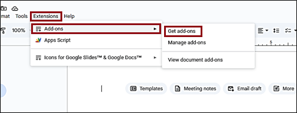
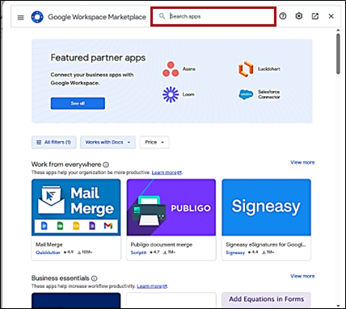
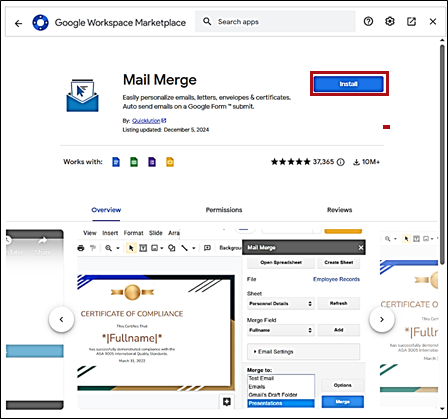
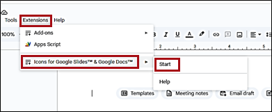
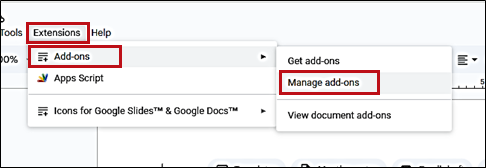
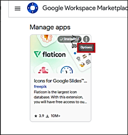
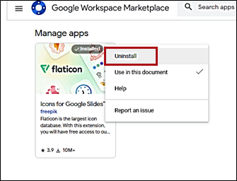
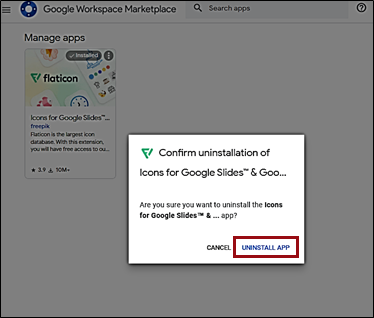

# **Manage add-ons in Google Docs**  

Add-ons in Google Docs are third-party applications that integrate directly with your documents to extend their capabilities. These add-ons can help you perform a variety of tasks, from citation management and document formatting to adding complex functions like mail merges or diagram creation. 

## **Install add-ons**

To install an add-on:

1. On the toolbar, click **Extensions** > :material-playlist-plus: **Add-ons**. 
2. To install a new app, click **Get add-ons**.  
          
3. In the dialogue, select the pre-set app from the list or type the name of your desired add-on in the search bar.  
        
4. Once you are on the page dedicated to the chosen app, click **Install**.  
      
Your new app appears in the list.

## **Use add-ons**

To use an add-on:

1. On the toolbar, click **Extensions**.  
2. Select the desired add-on from the list and click **Start**.  
      
The add-on opens in a new window or pane.

## **Remove add-ons**

To remove an add-on:  

1. On the toolbar, click **Extensions** > :material-playlist-plus: **Add-ons** > **Manage add-ons**.  
      
2. Select the required add-on and click :material-dots-vertical-circle-outline: **Options**.  
       
3. Click **Uninstall**.  
         
4. Confirm your choice by clicking **Uninstall App**.  
      
The add-on is removed. 

