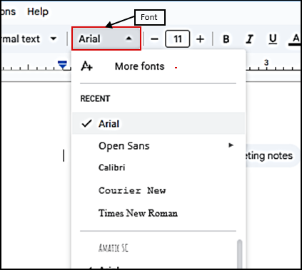
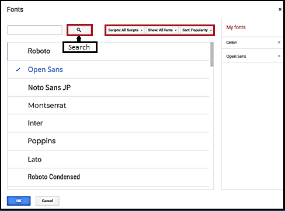
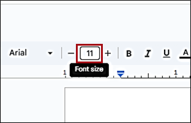
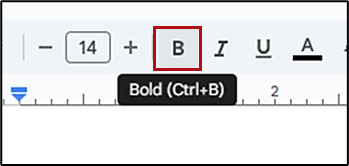
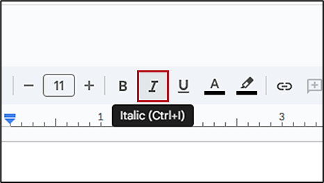
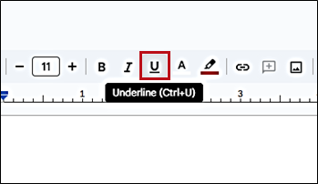
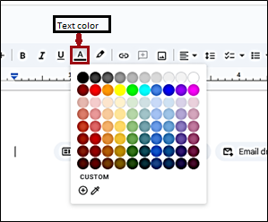
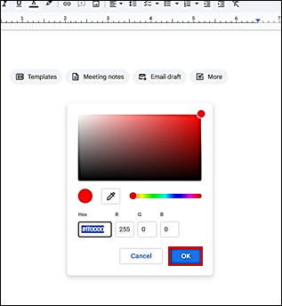
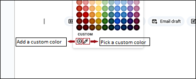
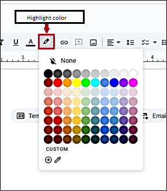

# **Format text**

There is a wide range of text formatting tools available for your Google Docs document. With these tools, your text becomes more structured and attractive to users.  

!!! Tip

    To apply the text formatting tools to a certain part of the already existing text, click and drag your cursor to select the text you want to  format.

## **Set text font**

To set the text font:

1. On the top menu bar, click **Font**.
2. Select the desired font from the list. 

Additionally, to customize your font list or add a new font, click  **More fonts**. In the dialog that opens, select a new font from the list or type the font name in the search field and click :octicons-search-16:  **Search**. 

To simplify your search, make a selection from the **Scripts**, **Show**, or **Sort** options. The list of fonts updates as per your search criteria.       

Added fonts also appear in the **My fonts** list on the right sidebar.  

 

## **Change font size**

To change the font size: 

1. On the top menu bar, go to **Font size**.
2. Type the desired font size.  
      
Alternatively, click **– Decrease font size** or **+ Increase font size** as required.

## **Make text bold**

To make your text bold, click :octicons-bold-16: **Bold** on the top menu bar.  
      
To cancel bold formatting, click :octicons-bold-16: **Bold** again.
## **Make text italic**

To make your text italic, click :octicons-italic-16: **Italic** on the top menu bar.  
      
To cancel italic formatting, click :octicons-italic-16: **Italic** again. 
## **Underline text**  
To underline your text, click  :material-format-underline: **Underline** on the top menu bar.  
      
To cancel underline formatting, click  :material-format-underline: **Underline** again. 

## **Set text color**

To set the text color: 

1. On the top menu bar, click :material-format-color-text: **Text color**. 
2. Select the desired text color from the palette.  
      
It is also possible to customize your text color. 

### **Create a custom color**

To create a custom color:  

1. Under **Custom**, click :octicons-plus-circle-16:  **Add a custom color**.
2. Enter the Hex code or the RGB values for the color you want.  
       
3. Click **OK**.

To pick a custom color: 

1. Under **Custom**, click :material-eyedropper-variant: **Pick a custom color**.
2. With the eyedropper tool, click any color on your screen.  
      

## **Highlight color** 

To highlight the text:  

1. On the top menu bar, click :material-format-color-highlight: **Highlight color**.  
      
2. Select the preset color from the palette or [**create a custom color**](#create-a-custom-color). 

