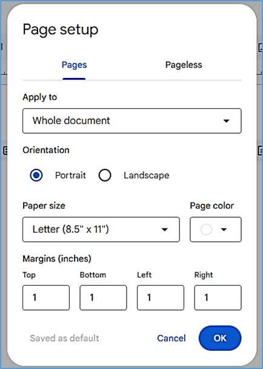
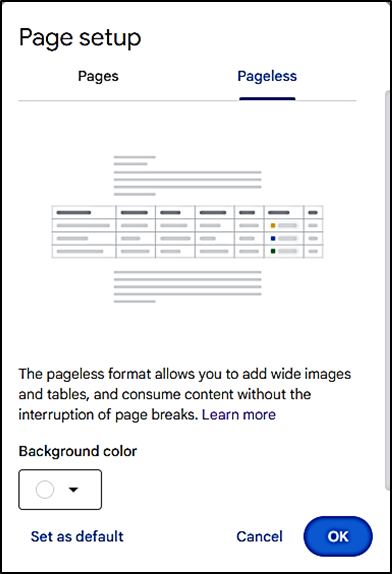
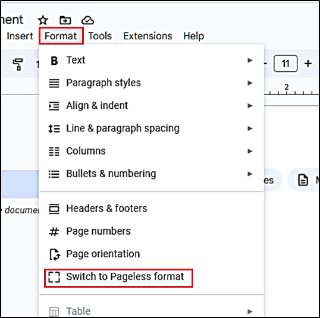

# **Manage page settings**
To manage the page settings in your Google Docs document:

1. Click **File** > :material-file-document-outline: **Page setup**.  
2. In the form that opens, select between **Pages** or **Pageless** tabs to define if your document has pages or doesn’t have page breaks. 
=== "Pages"  
    Set up your Google Docs document with pages and page breaks. In this setting, it is possible to add elements like headers and footers, page numbers, and more. Also, page settings, for example, page orientation and margin size, can be adjusted.  
    

    - To define if your current page settings are available for the whole document or previously selected content, go to the **Apply to** field and select the required item from the list.

    - To define the page orientation, select the appropriate radio button in the **Orientation** field.

    - To define the paper size, select the appropriate item in the **Paper size** field.

    - To set the page color, select the appropriate color in the **Page color** field.

    - To set the page margins, define the necessary size for top, bottom, left, and right margins in the **Margins (inches)** field.

    - To apply the set changes to your current document, click **OK**.

=== "Pageless"    
    Set up your Google Docs document so that it continuously scrolls without page breaks. In this setting, images adjust to your screen size, and you can create wide tables and view them by scrolling left and right. Line breaks for text also adjust to your screen size.  
      
    
    In pageless format, you can update the background color.  
    To apply these settings to any new document you create, click **Set as default**.

To switch formats at any time:

1. On the toolbar, click **Format**.
2. Select **Switch to Pageless format** or **Switch to Pages format** respectively.  
      

