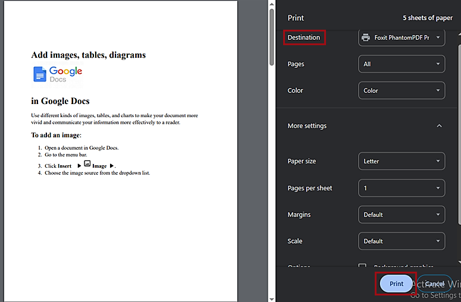

# **Print file**

To print your file with the preset options:

1. Click **File** > :fontawesome-solid-print: **Print**.  
2. To select your printer, go to **Destination** and select the required printer from the list.  

Optional: it is possible to define other print settings, for example:

- Pages to be printed (all or custom numbers).
- Color of pages to be printed (color or black and white).
- Paper size.
- Number of pages per sheet.
- Custom margins.
- Scale.

 When you are ready with all the required settings, click **Print**.

 Your file is printed.
