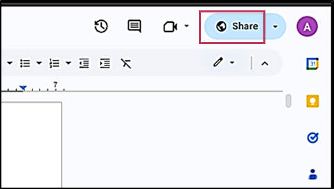
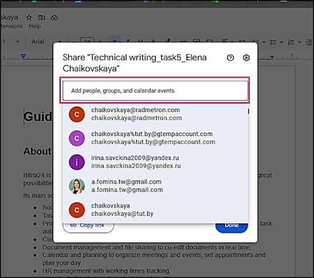
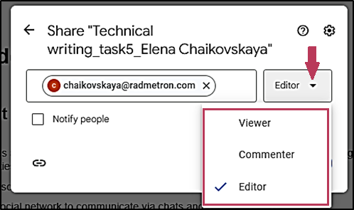
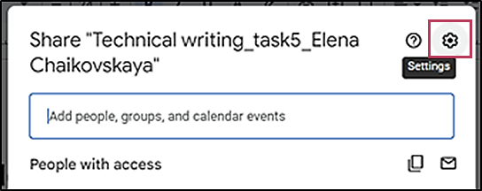
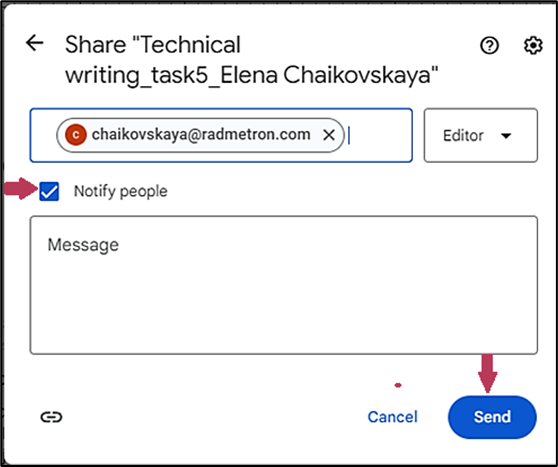
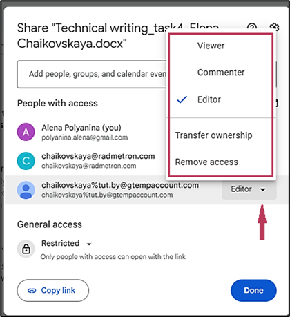
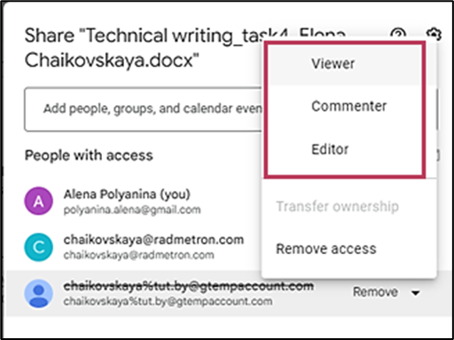
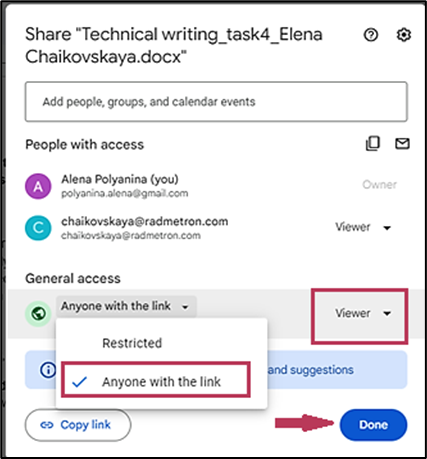
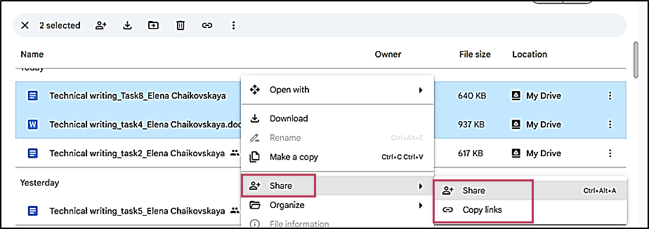

# **Manage access to Google Docs documents**

## **Set access options for current Google document**

To define the access options for the current Google document:

1. Click :fontawesome-solid-earth-americas: **Share**.  
      
2. Enter the email address of the file recipient or select the email address from the dropdown list.   
      
3. In the form that opens:

- To determine the addressee’s rights for the given file, select one of the checkboxes below and click **Share**.  
    - [Viewer](../ref.md)  
    - [Commenter](../ref.md)  
    - [Editor](../ref.md)  	

  

- To set or change permissions as per role assigned:  
    1. Click :material-cog-outline: **Settings**.
    2. Select or clear checkboxes according to your preferences.   
      
- To inform the person that you’ve shared the file with them:   
    1. Select the **Notify people** checkbox.  
    2. Fill in the **Message** field to provide any additional information.  
    3. Click **Send**.  
Otherwise, click **Cancel** to exit the form.  
      
## **Edit access options for a person**  
To edit the file permissions for the person with access, click :material-menu-down:  beside the person’s email address.  
      
From the dropdown list, it is possible to:  

- Change the person’s [access role](../ref.md).
- Transfer the ownership to the person. 

!!! Attention

    Ownership transfer is available for the [Editor](../ref.md) role only.

- Remove the given access.

!!! Note 

    To restore the access for the given person, click :material-menu-down:  and select one of the [access roles](../ref.md) checkboxes.   
    

## **Define general access options**

You can determine your file access options according to your preferences.  

### Provide access to anyone in the Internet
To provide access to your file to anyone:  

1. Under **General access**, click :material-menu-down:.  
2. Select **Anyone with the link**.   
3. Select the role that people will have for the file.     
4. Click **Done**.  
           
To send the link via email or any other messenger, click **Copy link**.   
Anyone with the link has access to the file.

### Limit access to the file

To limit access to your file:

1. Under **General access**, click :material-menu-down:.
2. Select **Restricted**.  
3. Click **Done**.

To send the link via email or any other messenger, click :material-link: **Copy link**.  
Only people with access are authorized to open the file.  
### Share multiple files
To share several files or a folder:  

1. Go to your Google Drive.  
2. Select and right-click the required files.   
3. Click :material-account-plus: **Share**.  
      
- To send the link via email or any other messenger, click :material-link: **Copy links**.
- To go to access options, click :material-account-plus: **Share**.

!!! Note 

    If you don’t have a permission to share at least one file from the list, the  **Share** option is inactive.

For further steps, see how to [**set the access options for the current Google document**](access.md). 
