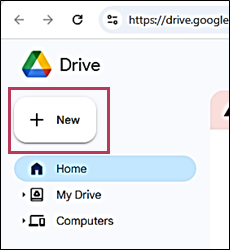
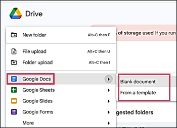
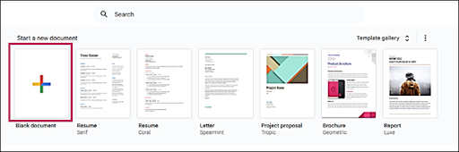
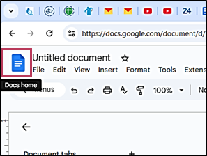
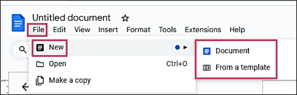

# **Create new document in Google Docs**
There are several possible ways to create new documents in Google Docs.
## **From your Google Drive**
To create a document from your Google Drive:  
1. Click **+ New**.  
      
2. Go to :material-sticker-text:{ .sticker } **Google Docs**.  
3. From the dropdown list:  
    - To add a new Google Docs document, click **Blank document**.  
    - To add the required preset template, click **From a template**.  
          
## **From Google Docs homepage**
To create a document from your Google Docs homepage:  
Under **Start a new document**, click  **Blank document** or select the desired template from the template gallery.  
      
## **From your current Google document**
To create a document from your current Google document:    
1. Click :material-file-document:{ .file-document } **Docs home**.  
      
2. Follow the steps [above](#from-google-docs-homepage).  
Alternatively:  
1. In the **File menu**, click :material-sticker-text: **New**.  
2. From the dropdown list:   
    - To add a new blank document, click :material-sticker-text:{ .sticker } **Document**.  
    - To add a preset template, click  **From a template**.    
       
Your new Google Docs document is created.

