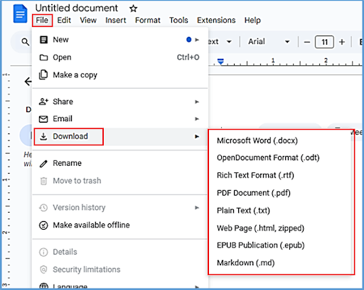

# **Download file**

To download a file in Google Docs:

1. In your current Google Docs document, click **File** > :octicons-download-16: **Download**.  
2. From the dropdown list, select the desired file format.  
      
The file is downloaded in the required format.

